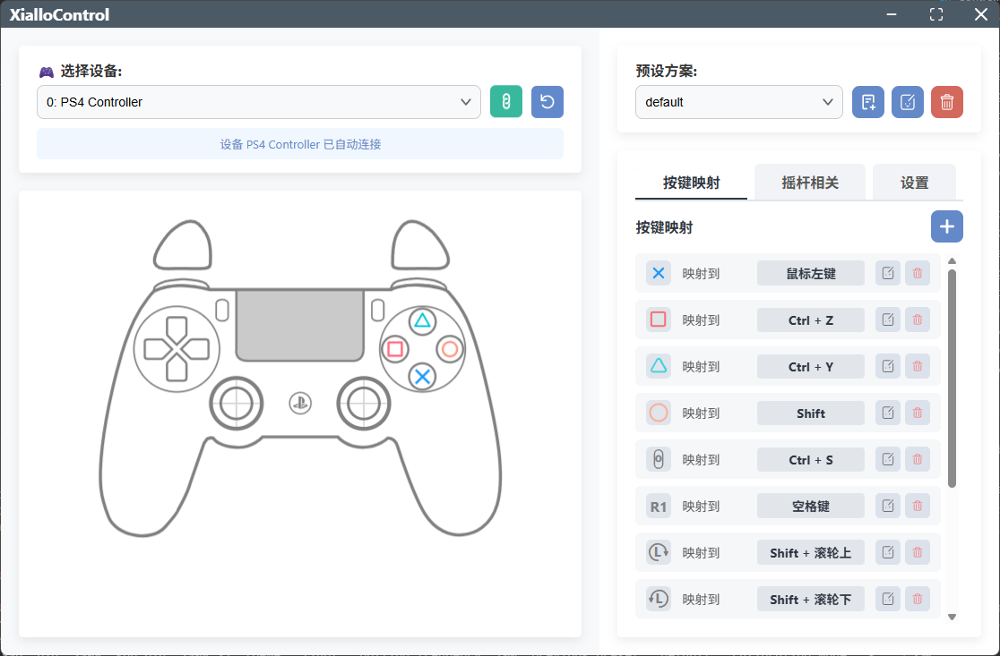

<h1 align="center">XialloControl</h1>

  <strong>通用手柄映射软件（支持各种主流手柄 Xbox、PS、SwitchPro）</strong>

  

  
  
   
  
  
  

---

### 功能特点：

### **XialloControl** 是一款：

#### 🎨 设计：
- **极简**：程序精简，windows 安装包仅有 **4 MB** 左右
- **美观**程度高，卡片式UI设计，操作界面一目了然！
- **高性能**服务提供！后端采用 Rust 语言设计，高效操作，丝滑无比！

#### ⚙️ 高级控制：
- **支持**单击、双击、长按映射，高度自定义。
- **支持**鼠标模拟控制，可以将摇杆作为鼠标使用（后续可能添加对 DS4 的触控板支持）
- **支持**自定义摇杆死区范围，优化操作精度
- **支持**市面多种手柄，如 Xbox、PS 等
- **高度**自定义手柄键位映射（支持鼠标、键盘映射、键盘鼠标按键和滚轮混合映射，
  支持各种快捷键，如：Shift+Alt+鼠标滚轮等复杂混合映射，满足多场景支持）
- **更多**：拖动列表项控制映射顺序

#### 🎮 创意工作优化：
- **灵敏**度可调，适应各种用户各种手感！
- **支持**摇杆映射（支持摇杆旋转映射、支持摇杆死区调整、支持摇杆映射为鼠标移动、画笔大小、画布缩放等操作）
- **支持**多预设方案（保存和导入多个预设配置，适应不同软件和工作流程）
- **支持**副预设快速切换功能，通过绑定切换按键，同时控制两套映射

#### 其他：
- **支持**开机自启，可调“自动连接手柄”，让你从开机到工作顺滑无比！
- **支持**托盘运行，最小化到系统托盘，不干扰创作过程！
- **安全**卸载，卸载后不影响手柄正常功能，您可以放心使用

---

### 🖼️ 界面预览

  

  

---

### 手柄和平台支持情况
#### 平台：

| 平台  |  Windows  |    Linux    |   MacOS   |
| :---: | :-------: | :---------: | :-------: |
| 情况  | ✅基本支持 | ⚠️计划支持 | ⚠️需要测试 |

#### 手柄：
| 手柄  |   Xbox    |    DS4    |    DS5        |   SwitchPro   |
| :-------: | :-------: | :-------: | :-------: | :-------: |
| 情况 | ✅基本支持 | ✅基本支持 | ⚠️需要测试  | ⚠️需要测试 |

---

### 📜 许可证

本项目的代码部分遵循 [GNU General Public License v3.0](LICENSE.txt) 许可证开源。

**关于图形资源**

本项目中使用的所有位于 `src/assets/controller` 目录下的 `.svg` 手柄布局图是本项目的原创作品，其版权归项目作者所有。

这些图形资源**不**在 GPLv3 许可范围内，并**保留所有权利 (All Rights Reserved)**。

未经项目作者明确的书面许可，**禁止**以任何形式对这些图形资源进行复制、修改、分发或用于商业目的。
