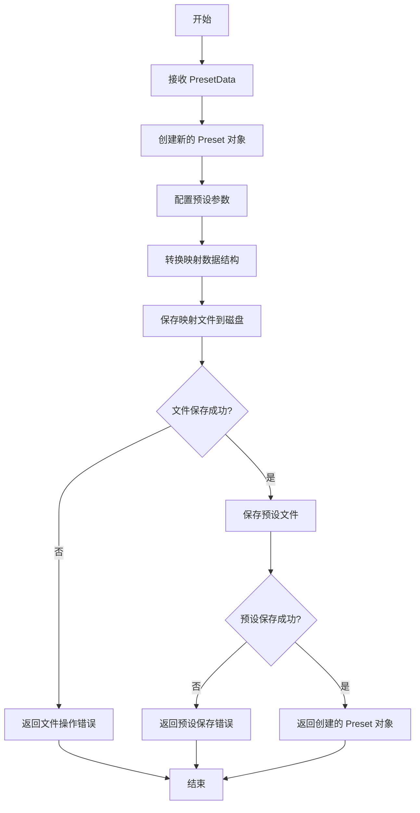

# Preset Construct 功能设计文档

## 概述

本文档描述了在 `src-tauri/src/preset.rs` 中添加 `preset_construct` 函数的设计方案，该函数根据预先设计好的数据结构创建实际的映射文件。

## 功能需求

- 在 `preset.rs` 中添加 `preset_construct` 函数
- 函数接收预设对象和预先构造好的数据结构
- 根据数据结构创建实际的映射文件
- 支持多种手柄类型（PS4、Xbox 等）

## 数据结构设计

### 1. 预设数据结构文件：`src-tauri/src/preset/preset_data.rs`

```rust
//! 预设数据结构定义
//! 用于预先设计好的预设数据

use serde::{Deserialize, Serialize};

/// 预设映射条目
#[derive(Debug, Clone, Serialize, Deserialize)]
pub struct PresetMappingData {
    /// 手柄按键名称（如 "Square", "A", "R1", "LT" 等）
    pub button: String,
    /// 对应的动作（如 "Control+z", "MouseLeft", "MouseWheelUp" 等）
    pub action: String,
    /// 修饰键列表（如 ["Control", "Shift"]）
    pub modifiers: Vec<String>,
    /// 按键检测模式（"single", "double", "long"）
    pub check_mode: String,
    /// 检测模式参数（双击间隔或长按时间）
    pub check_mode_param: u64,
    /// 触发阈值（主要用于扳机键）
    pub trigger_threshold: f32,
    /// 是否连续触发
    pub continually_trigger: bool,
    /// 触发间隔（毫秒）
    pub interval: u64,
    /// 初始触发间隔（毫秒）
    pub initial_interval: u64,
    /// 最小触发间隔（毫秒）
    pub min_interval: u64,
    /// 加速因子
    pub acceleration: f64,
}

/// 预设配置数据
#[derive(Debug, Clone, Serialize, Deserialize)]
pub struct PresetConfigData {
    /// 右摇杆死区范围 (%)
    pub deadzone: u8,
    /// 左摇杆死区范围 (%)
    pub deadzone_left: u8,
    /// 是否使用摇杆模拟鼠标
    pub use_stick_as_mouse: bool,
    /// 摇杆模拟鼠标配置
    pub stick_as_mouse_simulation: Option<String>,
    /// 鼠标移动速度 (1-100)
    pub move_speed: u8,
    /// 摇杆旋转触发阈值
    pub stick_rotate_trigger_threshold: i16,
    /// 副预设名称
    pub sub_preset_name: Option<String>,
    /// 副预设切换键
    pub sub_preset_switch_button: Option<String>,
    /// 副预设切换模式
    pub sub_preset_switch_mode: Option<String>,
}

/// 完整的预设数据
#[derive(Debug, Clone, Serialize, Deserialize)]
pub struct PresetData {
    /// 预设名称
    pub name: String,
    /// 预设描述
    pub description: Option<String>,
    /// 映射列表
    pub mappings: Vec<PresetMappingData>,
    /// 预设配置
    pub preset_config: PresetConfigData,
}
```

### 2. PS4 预设数据示例：`src-tauri/src/preset/ps4_example.rs`

```rust
//! PS4 手柄预设数据定义

use crate::preset::preset_data::PresetData;

/// FPS 游戏 PS4 预设数据
pub fn get_fps_preset_data() -> PresetData {
    PresetData {
        name: "FPS游戏预设".to_string(),
        description: Some("适用于第一人称射击游戏的 PS4 按键映射".to_string()),
        mappings: vec![
            PresetMappingData {
                button: "R2".to_string(),
                action: "MouseLeft".to_string(),
                modifiers: vec![],
                check_mode: "single".to_string(),
                check_mode_param: 300,
                trigger_threshold: 0.3,
                continually_trigger: false,
                interval: 300,
                initial_interval: 300,
                min_interval: 100,
                acceleration: 0.8,
            },
            PresetMappingData {
                button: "L2".to_string(),
                action: "MouseRight".to_string(),
                modifiers: vec![],
                check_mode: "single".to_string(),
                check_mode_param: 300,
                trigger_threshold: 0.3,
                continually_trigger: false,
                interval: 300,
                initial_interval: 300,
                min_interval: 100,
                acceleration: 0.8,
            },
            PresetMappingData {
                button: "Square".to_string(),
                action: "Control+z".to_string(),
                modifiers: vec!["Control".to_string()],
                check_mode: "single".to_string(),
                check_mode_param: 300,
                trigger_threshold: 0.3,
                continually_trigger: false,
                interval: 300,
                initial_interval: 300,
                min_interval: 100,
                acceleration: 0.8,
            },
            PresetMappingData {
                button: "Triangle".to_string(),
                action: "Control+y".to_string(),
                modifiers: vec!["Control".to_string()],
                check_mode: "single".to_string(),
                check_mode_param: 300,
                trigger_threshold: 0.3,
                continually_trigger: false,
                interval: 300,
                initial_interval: 300,
                min_interval: 100,
                acceleration: 0.8,
            },
            PresetMappingData {
                button: "Cross".to_string(),
                action: "MouseX1".to_string(),
                modifiers: vec![],
                check_mode: "single".to_string(),
                check_mode_param: 300,
                trigger_threshold: 0.3,
                continually_trigger: false,
                interval: 300,
                initial_interval: 300,
                min_interval: 100,
                acceleration: 0.8,
            },
            PresetMappingData {
                button: "Circle".to_string(),
                action: "Shift".to_string(),
                modifiers: vec!["Shift".to_string()],
                check_mode: "single".to_string(),
                check_mode_param: 300,
                trigger_threshold: 0.3,
                continually_trigger: false,
                interval: 300,
                initial_interval: 300,
                min_interval: 100,
                acceleration: 0.8,
            },
            PresetMappingData {
                button: "Options".to_string(),
                action: "Control+s".to_string(),
                modifiers: vec!["Control".to_string()],
                check_mode: "single".to_string(),
                check_mode_param: 300,
                trigger_threshold: 0.3,
                continually_trigger: false,
                interval: 300,
                initial_interval: 300,
                min_interval: 100,
                acceleration: 0.8,
            },
            PresetMappingData {
                button: "LeftStickCW".to_string(),
                action: "Shift+MouseWheelUp".to_string(),
                modifiers: vec!["Shift".to_string()],
                check_mode: "single".to_string(),
                check_mode_param: 300,
                trigger_threshold: 0.3,
                continually_trigger: false,
                interval: 300,
                initial_interval: 300,
                min_interval: 100,
                acceleration: 0.8,
            },
            PresetMappingData {
                button: "LeftStickCCW".to_string(),
                action: "Shift+MouseWheelDown".to_string(),
                modifiers: vec!["Shift".to_string()],
                check_mode: "single".to_string(),
                check_mode_param: 300,
                trigger_threshold: 0.3,
                continually_trigger: false,
                interval: 300,
                initial_interval: 300,
                min_interval: 100,
                acceleration: 0.8,
            },
            PresetMappingData {
                button: "RightStickCW".to_string(),
                action: "MouseWheelUp".to_string(),
                modifiers: vec![],
                check_mode: "single".to_string(),
                check_mode_param: 300,
                trigger_threshold: 0.3,
                continually_trigger: false,
                interval: 300,
                initial_interval: 300,
                min_interval: 100,
                acceleration: 0.8,
            },
            PresetMappingData {
                button: "RightStickCCW".to_string(),
                action: "MouseWheelDown".to_string(),
                modifiers: vec![],
                check_mode: "single".to_string(),
                check_mode_param: 300,
                trigger_threshold: 0.3,
                continually_trigger: false,
                interval: 300,
                initial_interval: 300,
                min_interval: 100,
                acceleration: 0.8,
            },
            PresetMappingData {
                button: "DPadUp".to_string(),
                action: "VirtualKeyboard".to_string(),
                modifiers: vec![],
                check_mode: "single".to_string(),
                check_mode_param: 300,
                trigger_threshold: 0.3,
                continually_trigger: false,
                interval: 300,
                initial_interval: 300,
                min_interval: 100,
                acceleration: 0.8,
            },
        ],
        preset_config: PresetConfigData {
            deadzone: 10,
            deadzone_left: 10,
            use_stick_as_mouse: true,
            stick_as_mouse_simulation: Some("right".to_string()),
            move_speed: 25,
            stick_rotate_trigger_threshold: 15,
            sub_preset_name: None,
            sub_preset_switch_button: None,
            sub_preset_switch_mode: None,
        },
    }
}
```

## 函数接口设计

### `preset_construct` 函数

在 `src-tauri/src/preset.rs` 中添加以下函数：

```rust
use crate::preset::preset_data::PresetData;

/// 根据预设数据构造实际的映射文件和预设
/// 
/// # 参数
/// * `preset_data` - 预设数据
/// 
/// # 返回值
/// * `Result<Preset, String>` - 成功返回创建的 Preset 对象，失败返回错误信息
#[tauri::command]
pub fn preset_construct(preset_data: &PresetData) -> Result<Preset, String> {
    // 1. 创建新的 Preset 对象
    let mut preset = Preset::new(preset_data.name.clone());
    
    // 2. 配置预设参数
    preset.items.deadzone = preset_data.preset_config.deadzone;
    preset.items.deadzone_left = preset_data.preset_config.deadzone_left;
    preset.items.use_stick_as_mouse = preset_data.preset_config.use_stick_as_mouse;
    preset.items.stick_as_mouse_simulation = preset_data.preset_config.stick_as_mouse_simulation.clone();
    preset.items.move_speed = preset_data.preset_config.move_speed;
    preset.items.stick_rotate_trigger_threshold = preset_data.preset_config.stick_rotate_trigger_threshold;
    preset.items.sub_preset_name = preset_data.preset_config.sub_preset_name.clone();
    preset.items.sub_preset_switch_button = preset_data.preset_config.sub_preset_switch_button.clone();
    preset.items.sub_preset_switch_mode = preset_data.preset_config.sub_preset_switch_mode.clone();
    
    // 3. 生成映射文件内容
    let mappings = convert_to_mappings(&preset_data.mappings)?;
    
    // 4. 保存映射文件
    save_mappings_to_file(&preset, &mappings)?;
    
    // 5. 保存预设文件
    if !preset.save() {
        return Err("保存预设文件失败".to_string());
    }
    
    // 6. 返回创建的 Preset 对象
    Ok(preset)
}
```

### 辅助函数

```rust
fn convert_to_mappings(mapping_data: &[PresetMappingData]) -> Result<Vec<Mapping>, String> {
    use std::time::{SystemTime, UNIX_EPOCH};
    
    let mut mappings = Vec::new();
    
    for data in mapping_data {
        let id = SystemTime::now()
            .duration_since(UNIX_EPOCH)
            .unwrap()
            .as_millis() as u64;
            
        // 解析动作
        let action = parse_composed_key_to_action(&data.action)
            .map_err(|e| format!("解析动作失败 '{}': {}", data.action, e))?;
        
        // 创建映射对象
        let mapping = Mapping {
            id,
            composed_button: data.button.clone(),
            composed_shortcut_key: data.action.clone(),
            check_mode: parse_check_mode(&data.check_mode)
                .map_err(|e| format!("无效的检测模式 '{}': {}", data.check_mode, e))?,
            check_mode_param: data.check_mode_param,
            trigger_theshold: data.trigger_threshold,
            action,
            trigger_state: TriggerState {
                continually_trigger: data.continually_trigger,
                interval: data.interval,
                initial_interval: data.initial_interval,
                min_interval: data.min_interval,
                acceleration: data.acceleration,
                last_trigger: std::time::Instant::now(),
                is_pressed: false,
            },
        };
        
        mappings.push(mapping);
    }
    
    Ok(mappings)
}

fn parse_check_mode(mode_str: &str) -> Result<CheckMode, String> {
    match mode_str {
        "single" => Ok(CheckMode::Single),
        "double" => Ok(CheckMode::Double),
        "long" => Ok(CheckMode::Long),
        _ => Err(format!("未知的检测模式: {}", mode_str)),
    }
}

fn save_mappings_to_file(preset: &Preset, mappings: &[Mapping]) -> Result<(), String> {
    use crate::xeno_utils;
    use std::path::PathBuf;
    
    // 确保预设目录存在
    let preset_dir = crate::xeno_utils::ensure_dir(&PathBuf::from("presets").join(&preset.name))
        .ok_or_else(|| "无法创建预设目录".to_string())?;
    
    // 保存映射文件
    let mappings_file = preset_dir.join(&preset.items.mappings_file_name);
    let mapping_file_data = MappingFile { mappings: mappings.to_vec() };
    
    xeno_utils::write_toml_file(&mappings_file, &mapping_file_data)
        .map_err(|e| format!("保存映射文件失败: {}", e))?;
    
    log::info!("映射文件已保存到: {:?}", mappings_file);
    Ok(())
}
```

## 实现流程



## 使用示例

```rust
// 获取预设数据
let fps_preset_data = ps4_example::get_fps_preset_data();

// 调用构造函数
match preset_construct(&fps_preset_data) {
    Ok(created_preset) => {
        println!("预设 '{}' 创建成功！", created_preset.name);
        // 可以继续使用创建的预设
    }
    Err(error) => {
        eprintln!("预设创建失败: {}", error);
    }
}
```

## 扩展性

### 支持其他手柄类型

可以通过创建类似的 `xbox_example.rs` 文件来支持 Xbox 手柄：

```rust
//! Xbox 手柄预设数据定义

use crate::preset::preset_data::PresetData;

/// FPS 游戏 Xbox 预设数据
pub fn get_fps_preset_data() -> PresetData {
    PresetData {
        name: "FPS游戏预设".to_string(),
        description: Some("适用于第一人称射击游戏的 Xbox 按键映射".to_string()),
        mappings: vec![
            PresetMappingData {
                button: "RT".to_string(),      // Xbox RT 对应 PS4 R2
                action: "MouseLeft".to_string(),
                modifiers: vec![],
                check_mode: "single".to_string(),
                check_mode_param: 300,
                trigger_threshold: 0.3,
                continually_trigger: false,
                interval: 300,
                initial_interval: 300,
                min_interval: 100,
                acceleration: 0.8,
            },
            // ... 更多映射
        ],
        preset_config: PresetConfigData {
            deadzone: 10,
            deadzone_left: 10,
            use_stick_as_mouse: true,
            stick_as_mouse_simulation: Some("right".to_string()),
            move_speed: 25,
            stick_rotate_trigger_threshold: 15,
            sub_preset_name: None,
            sub_preset_switch_button: None,
            sub_preset_switch_mode: None,
        },
    }
}
```

## 注意事项

1. **不影响原有代码**：新功能完全独立，不修改现有的数据结构和函数
2. **错误处理**：所有文件操作和解析操作都有适当的错误处理
3. **日志记录**：重要的操作都会记录日志
4. **类型安全**：使用强类型确保数据正确性
5. **可扩展性**：设计支持轻松添加新的手柄类型和预设

## 文件结构

```
src-tauri/src/preset/
├── mod.rs              # 模块声明
├── preset.rs           # 原有预设功能
├── preset_data.rs      # 新增：预设数据结构定义
├── ps4_example.rs      # 新增：PS4 预设数据示例
├── xbox_example.rs     # 新增：Xbox 预设数据示例
├── ps4_csp.rs         # 原有文件
└── xbox_csp.rs         # 原有文件
```

## 测试策略

1. **单元测试**：测试数据转换逻辑
2. **集成测试**：测试完整的预设构造流程
3. **边界测试**：测试空数据、无效数据等边界情况